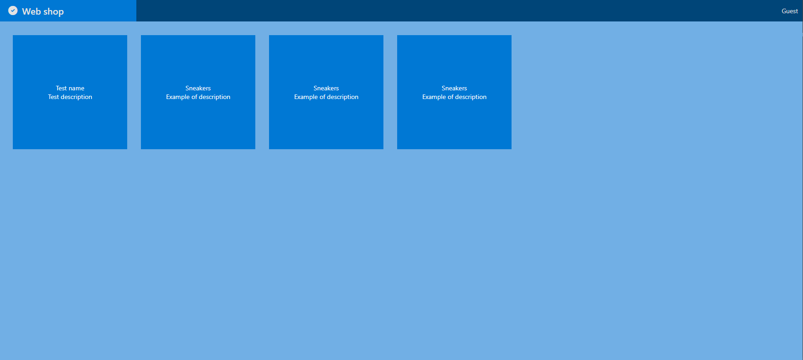
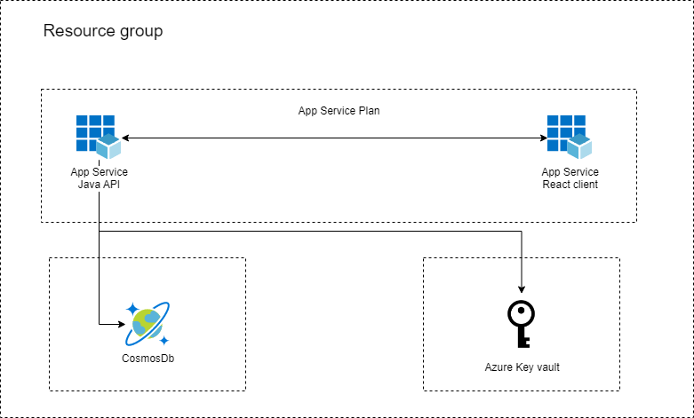

# Web shop test

To perform initial provisioning of infrastructure run (az and azd cli command required):

`az login`

`azd up`

You should see the following after deployment:

Deploying services (azd deploy)

(✓) Done: Deploying service api
- Endpoint: https://app-api-<ident>.azurewebsites.net/

(✓) Done: Deploying service web
- Endpoint: https://app-web-<ident>.azurewebsites.net/

SUCCESS: Your Azure app has been deployed!

Right now the only thing the application does it keep som persisted data in CosmosDb, and this data is rendered in the
React web app service.

The Github action 

There are two endpoints:

Fetches all products from CosmosDb
https://app-api-<ident>.azurewebsites.net/products

Create a new product and save it to the database
https://app-api-<ident>.azurewebsites.net/products/<product id>

## Schema

